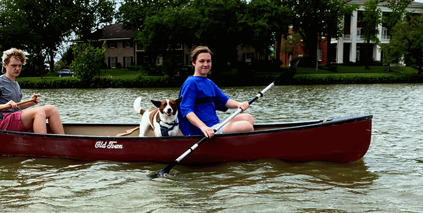

+++
title = "1. The Dream"
date = "2021-01-10"
lastmod = "2021-01-27"
draft = false
showonlyimage = false
image = "blog/2021-01/one-ocean-cirrus-sng.jpg"
categories = ["planning"]
tags = ["design", "sources", "technique"]
weight = 0
+++

I've been dreaming of owning a fast, light kayak for years...decades really. I got the bug shortly after moving to Sarasota on Florida's Gulf coast in 2000.<!--more--> 

The calm gulf waters, protected bays and slow moving rivers which empty into them are a perfect environment to paddle, enjoy nature, and get some exercise. During my ten years there I bought a big yellow plastic sit-on-top "Cayman" by [Dagger Kayaks](https://www.dagger.com/us/) (long discontinued) which got lots of use around Ft. Desoto Park, on the Hillsboro River, and in Sarasota Bay. For a year we lived in Temple Terrace just two blocks from [Riverhills Park](https://templeterrace.com/517/Riverhills-Park) so I built a wheeled dolly to tote "big yellow" to the launch and back. A year or so later I picked up a green fiberglass boat custom designed by a Massachusetts boat shop. Primitive by today's standards, it was beamy but stable for my young sons and I would sometimes tow it behind big yellow. sit-on-top could carry plenty of gear and weight wasn't an issue when I loaded it on my wife's Ford Taurus wagon, but when we ditched the wagon for a Kia minivan I found it challenging to load the boat on top of the taller van. I could lift it by myself, but occasionally something would slip and I'd scratch or dent the van, and at one point I injured my shoulder. We had the occasion to rent kayaks with friends while on a day-trip and I had the opportunity to paddle a longer, thinner fiberglass kayak. Wow, what a difference. Then one day along the Sarasota bayfront I saw someone launching a wooden kayak and I was awe struck. The boat was beautiful! I had to go strike up a conversation with the owner. I learned about the "stitch-n-glue" process and the owner showed me how light weight it was and said it was responsive and fun to paddle. When I got home that evening I started searching the web...

### Image Gallery

These thumbnails enlarge when you click them. Pictured are my first two kayaks. You'll see one of my sons as a baby sitting in a friend's touring kayak, a kayak drawn in cake icing on occasion of my 40th birthday, a nephew enjoying the Hillsboro River on my Dagger Cayman sit-on-top, and photos of a short and beamy, old fiberglass boat by a builder in [Martha's Vineyard](https://goo.gl/maps/GH1EDH5pfh55E3YB7) which I repainted.



Research led me to discovery of [Pygmy Boats](http://www.pygmyboats.com/) and [Chesapeak Light Craft](https://www.clcboats.com/), and smaller wooden kayak kit providers as well. I joined internet discussion groups, ordered catalogs and study plans, and began taking account of what I'd need. I created a spreadsheet listing the required materials for each boat design with detailed quantities and costs, so I could determine which design would be the most economical to build. I started researching material suppliers and, as a Florida resident, I was pleased to find sources only a few hours drive away on the east coast. My web searches and discussion forum research also drew me to one particular design, the 'Cirrus' by [One Ocean Kayak](http://www.oneoceankayaks.com/stitchglue/Cirrustech.htm). The designer, Vaclav Stejskal, provides more detailed technical information about his boat designs than any of the other suppliers, and I like his "strongback" assembly method which doesn't use interior temporary spacers and ensures a straight and true boat. I ordered the construction manual for the Cirrus and practically devoured it. It contains so many well illustrated and practical tips it is worth purchasing even if you're not building a One Ocean design. I updated my spreadsheet with new information and rekindled my eagerness to build a boat.

 

But this was a busy time in my life. My wife and I were starting a family, and we decided the best person to care for our babies was her - not a daycare facility - so for a while I was the sole income earner. Money was tight and since I already had a plastic kayak, building a new boat from scratch just wasn't sensible. I did pick up an old used fiberglass boat on the cheap though. Years passed, the "great recession" hit Florida particularly hard, and we had to leave the state to resurrect my career. Our babies had grown to toddlers, then to boys in elementary school. Now, in a new state and without a boat (I had sold both kayaks during the recession), my dream of a stitch-n-glue kayak grew from thoughts of producing one boat to building three. I imagined enjoying the sport with my sons. Still, recovering financially from the recession took time, and I decided that the most affordable boat for out immediate enjoyment was a used canoe.

The canoe has been fun, and our dog especially enjoys these adventures, but the desire for a lighter and swifter boat continued to nag at me. I also want to start a project with my sons to teach them some carpentry skills along with persistence and patience. They're now young men in high school and the oldest is approaching graduation. Now was the time to act so that we could have this experience together. I began placing orders for materials. My dream was on its way to becoming a reality!

