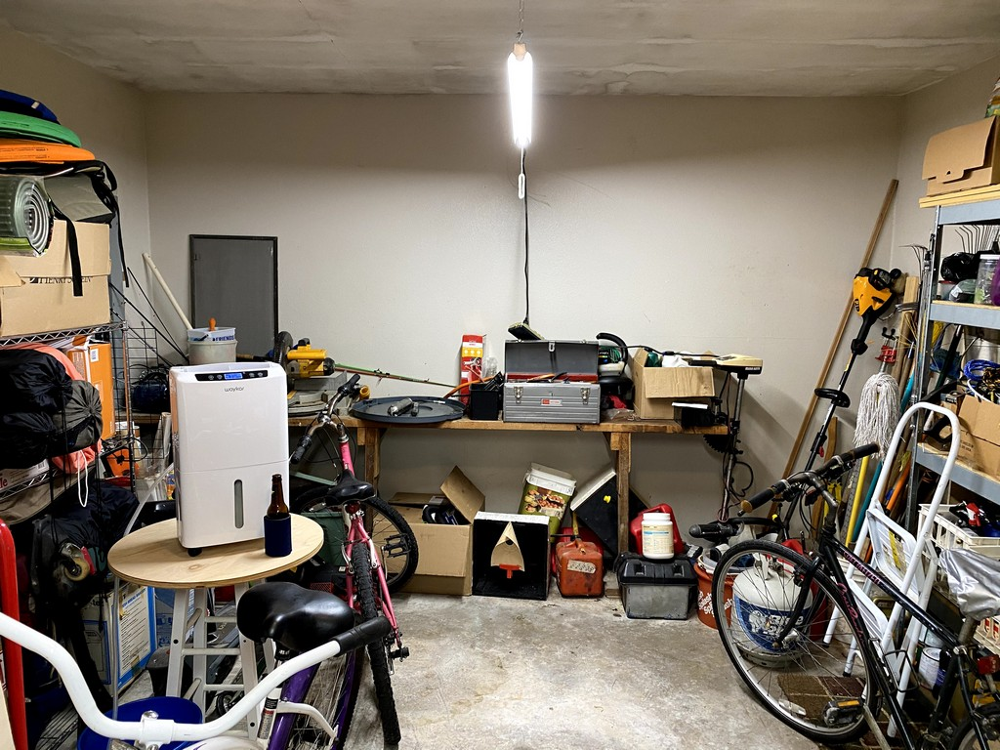
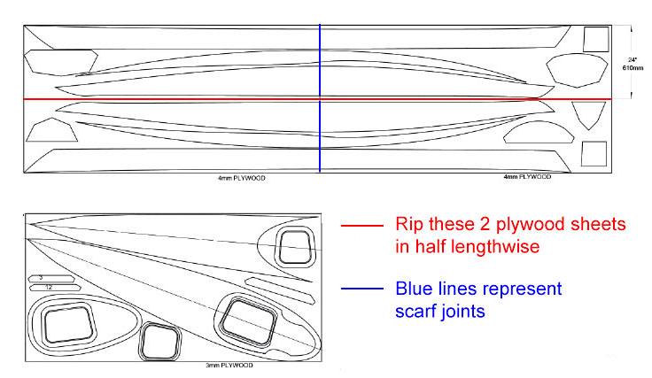

+++
title = "3. Setting Up Shop"
date = "2021-02-01"
lastmod = "2021-02-17"
draft = false
showonlyimage = false
image = "blog/2021-02b/shop-500px.jpg"
categories = ["planning", "carpentry"]
tags = ["supplies", "shop", "tools"]
weight = 0
+++

Making room to assemble these boats seems nearly as challenging as building them.<!--more--> Our ranch-style residence features a 2-car carport and adjacent, non-climate controlled storage room. Similar homes in our subdivision sometimes feature a roll-up door on these storage rooms but ours does not. Instead there is a single walk-in door on one side and a window on the opposite side facing the backyard. My sons and I confirmed that we would, in fact, be able to move a 14.5' long kayak into and out of this room through the doorway before proceeding further with this project. 

## Taming the Utility Room

With that test passed, I spent several weekends removing boxes, bins and furniture from this room. I purchased a dehumidifier to try to address the humidity problem caused by moisture seeping up through the concrete slab, and I hung two 4' LED shop lights from the ceiling. I've still got a ways to go finding a new home for some of this stuff.

## Receive Materials

Materials were received and stored. More effort was required to clear off some workbench and shelf space to accomodate the materials and tools. Some builders have devised methods for suspending parts from the ceiling, either to simply get them up out of the way or to allow the builders a touch-free place to dry or cure woodwork. I'll consider this.

## Work Surface

One needs a long, narrow work table on which to cut out and assemble these long and sometimes delicate plywood components into the pieces for a hull and deck. Using one sheet of 11/32 plywood and some 2 x 4s, I built a 14' x 2' table resting on three saw horses. Care was taken to ensure the table was level and flat. Fourteen feet is 6" shorter than the final length of the Shearwater Sport, so if you've got the room I recommend building the table 15' in length. Others also tend to use thicker plywood. My workshop is pressed for space so I elected to go shorter and lighter. Below are photos of the finished workbench and some of the tools I'll be using.


 

## Tech Time - Project Cam

Several builders have posted time-lapse videos showing a sped-up recap of their kayak build process and I wanted to do the same. Obviously, this task is pure vanity and has nothing to do with the kayak build project itself, so this time and expense was just something to do while south Louisiana endured some dank winter weather during February.

I considered four options:

1) My knock-off "go-pro" couldn't do it because it can't be programmed to take time lapse photos, and it would simply go to sleep after a short period of inactivity.
2) My iPhone 11 Pro cell phone would take fantastic quality images, and I'll certainly use it to document the process, but there's no way I'm going to stick it to the wall for hours at a time to take time-lapse photos. iPhone apps to take time-lapse photos seem to set intervals in seconds, not periods of 10 or 15 minutes. As above, my phone would go to sleep to conserve it's battery.
3) Add another IP security cam to my home surveillance system would work, and I could program that one camera separately from all others to ignore the motion detection and simply take time-lapse photos. I'd also have to purchase 75' of CAT5e cable and once installed the security cam would be in a fixed position. Boo.
4) [Raspberry Pi](https://www.raspberrypi.org/) wifi cam - WINNER! It is easily programmed to take time-lapse photos at any interval, it's always on, yet is a power miser. It can be moved around and repositioned since it only needs electricity and proximity to my home wifi router. For truly wireless, the Pi can be temporarily powered with a cell phone battery!

Following [these](https://www.youtube.com/watch?v=rhIzfRmKHnQ) and [these](https://www.youtube.com/watch?v=8fcbP7lEdzY) instructions, I purchased, assembled components, configured the software, and installed a wifi cam at one end of the workshop. This is a Raspberry Pi Zero W single-board computer running [MotionEyeOS](https://github.com/ccrisan/motioneyeos/wiki) with a 3 megapixel camera connected to the Pi and all of this enclosed in a plastic case. I'm at about $40 all-in, with the micro-SD card. I also use MotionEye on a LINUX box to control [my home security cameras](https://howisjt.com/posts/tech-home-security/), so I was already somewhat familiar with that. Below are a few photos of this contraption. While disassembled you can see the green LED on the Pi shows it is powered on, and the red LED on the camera shows it is active. I strapped the camera to a C-clamp, clamped it to a shelf, plugged it in and pointed it appropriately. All of the rest is controlled remotely by logging into the camera's IP address from my laptop. 


 

This is strictly an internal LAN or home network feed. I'm not opening ports in my router to publish this to the web. It's purpose is to capture time-lapse photos of our work onto the micro SD card which I'll periodically download and store elsewhere until I'm ready to produce a video.

Here's the finished video. The device didn't capture images toward the end of my build process so this is as good as it gets...



 

## Beginning Work

*Let's go!* It's time to begin some real work on this kayak construction project. The tail that wags the dog is the long, delicate pieces of plywood that form the hull. We've got to trace them from the plans onto our sheets of Okoume ply and cut them out. But first we must join a few 8' long sheets of plywood together to make 16' long sheets. Why and how we went about this are outlined below, but let's begin with how we get these parts from the plywood sheets.

## Study Plans

CLC sells "study plans" for $1 that provides some general sketches of the kayak design including the layout of pieces on the sheets of plywood. In an effort not to violate their copyright I'll share a low resolution image of just the sheet layout to show how the three full sheets of marine plywood yield all of the component parts for one boat. Essentially, the top or deck pieces all come from one 4 x 8 sheet - which may be the thinner and lighter 3mm Okoume. The hull and some bulkhead and spacer pieces come from two 4 x 8 sheets of the thicker 4mm Okoume. Because they are so long, we first rip these two 4 x 8 sheets of 4mm in half lengthwise to yield four 2' x 8' sheets, and then join together the pairs in preparation for tracing pieces.

