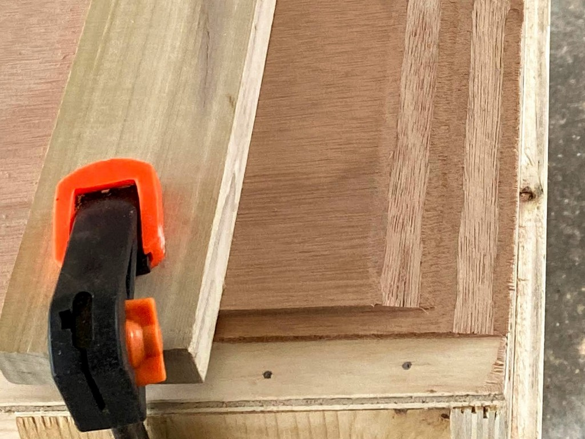
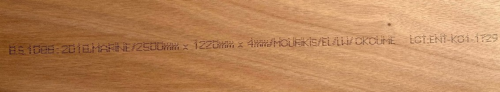

+++
title = "4. Begin!"
date = "2021-02-20"
lastmod = "2021-02-20"
draft = false
showonlyimage = false
image = "blog/2021-02c/pic01.jpg"
categories = ["carpentry"]
tags = ["technique", "plywood","scarf", "tools"]
weight = 0
+++

Measure twice...cut once! We begin the careful process of cutting the components for the kayaks from plywood sheets. <!--more-->Following several weekends of poor weather it is finally time to begin work on our boats. The initial steps require more space than is available within our workshop, so we'll spread out under the carport. We'll cut the 4mm Okoume sheets in half lengthwise and scarf the pairs together to form 16' long sheets. Then we'll roll out the plan templates and use a punch or ice pick to perforate the lines on the paper templates to transfer them to the plywood beneath. We'll also drill the holes for the copper wire stitches at the locations designated on the plans. After removing the paper plans, we'll sketch on the plywood between the pricks with a pencil to transfer the patterns. Both circular saws and a jigsaw will be used to cut out the pieces.

	- constructing and using a scarfing jig
	- transferring the patterns, drilling stitch holes
	- cutting out pieces, labeling
	- sanding the edges
	- drilling stitch holes
	- bevel the edges
	- stitch parts together

## Scarf Joints

Most marine plywood is available in roughly 4' x 8' sheets, although sometimes you can get it in 10' long sheets. Mine are 4 x 8 or a close metric equivalent. Kayaks are considerably longer than 8', so we must join two sheets of plywood to make one *long* sheet from which the hull parts can be cut. There are three common types of joints: butt, puzzle and scarf. **Butt** joints simply butt up the edges of two plywood sheets and glue them together with epoxy - often with a side facing of fiberglass cloth and sometimes by affixing a short slab of plywood, a "butt block", as it's called. Some argue this is the weakest joint if it lacks the butt block, and butt blocks present problems on the inside of the cockpit because they take up a bit of space, get in the way of other components, and add a little weight. **Puzzle** joints are created by computer controlled (CNC) routers and are often provided by kit manufacturers. Hobbyists rarely have a CNC router at their disposal, so puzzle joints are out. **Scarf** joints are strong, add no extra weight or thickness to the panel, and if done properly will feather nicely into the exterior finish with scarcely a line to show for it other than the change in wood grain.

A "scarf" is simply cutting a uniform inclined plane along opposite edges of two panels and bonding them together with glue or epoxy. Many craftsman create scarfs by carefully lining up and clamping down the panels to immobilize them, and then cutting the approximately 2" wide scarf with a sharp block plane. Keeping the layers of the plywood as straight lines in the cut ensures you're making a uniform cut. Builder discussion forums are loaded with recommendations on which block plane is the best and be assured it is often the most expensive.

Understanding that the scarf joint itself consumes up to 2" of wood for the overlap, the 16" scarfed plywood length is really just 15'-10". As we saw in the [parts layout diagram](./plywood-layout-shearwater-sport-labeled.jpg), the components on the right side of the diagram have surplus space around them. We'll squeeze them more tightly together to make up for that 2" loss of plywood length.

### Build a Jig

Vaclav of [One Ocean Kayaks](http://www.oneoceankayaks.com/stitchglue/plyshophtm/scarfjig2.htm) presents an alternative to the block plane for cutting scarfs: by using a sharp circular saw and a "scarfing jig." I chose this method because I don't trust my ability to stay uniform with the block plane. The jig was constructed of a scrap from the 3/8" plywood sheet used to construct my work bench, some scrap 1" x 6" lumber as the braces, and one 30" long piece of straight and true hardwood which will be glued and screwed to the plywood as the saw guide. Below are photos of the scarf-jig construction process. The magic acute angle is 80-1/2 degrees. 


 

### Cutting Scarfs

We expanded into the 2-car carport to have room to maneuver the plywood sheets. Those for the hull must be ripped in half lengthwise first, making two 2' x 8' sheets. Then, we'll join these pairs together lengthwise with scarfs. Here is pictured the BS1088 stamp on the plywood I purchased from [World Panel](https://www.worldpanel.com/).

With the sheets of 4mm plywood ripped in half lengthwise, we set up the jig and cut scarfs. The gallery of images below illustrate the process. Following directions in the manual by Vaclav at [One Ocean Kayaks](http://www.oneoceankayaks.com/) we arranged the sheets in pairs with the "good" surfaces facing inward and the top sheet was set back about one inch.

My very first attempt was a failure, so learn from my mistakes:
- The clamps failed to hold the hardwood block across the plywood providing uniform downward pressure. 
- I tried screws (as I'd read on forums) along the edges, but this again left the plywood bowed up in the middle.
- I went back to the hardwood block and inserted a shim in the center, allowing uniform force to hold down the plywood uniformly.
- I failed to secure (screw) my scarf jig to the workbench so during a cut it shifted. And, though clamped on the sides it was also bowed up in the middle, worsening my problem. I screwed both sides and also the top center to the workbench.
- I relied on the numerical gauge on the base plate of my circular saw to identify 90 degrees. I should have checked it with a square. It was off, and I had to adjust the blade tilt angle by 3+ degrees to produce a longer scarf cut.

So, with the above lessons learned, we eventually created some acceptable scarf cuts which I improved with my block plane. Most build manuals and forum discussion recommend a low-angle block plane, but I successfully used what I had. Before gluing these pairs together we'll dry fit them and dress up any severe imperfections with the block plane or belt sander.


 
 

> There has been a two month gap since I last worked on this project, with the exception of tracing deck patterns onto 3mm plywood. The delays were caused by weather and prior commitments. Due to space limitations, we had to join the plywood sheets together in the carport since there is insufficient room in our shop / storage room. The process required a minimum of two consecutive days with pleasant, dry weather and south Louisiana either experienced rain (and a couple of cold snaps) during these weekends. Or, we had other activities planned such as birthdays, etc. Easter weekend brought spectacular weather following the passing of a strong cold front and we resumed our work.

### Gluing Scarf Joints

As I said to my wife - "Now we've reached the point of no return." Once these 8' long plywood sheets are joined to become 16' long we've got issues with where to store stuff, so continual progress will be essential to return our carport to the cars that live there. We glued multiple sheets of plywood together, so we laid them all out with scarf cuts exposed, applied a layer of unthickened epoxy, and let it soak into the wood grain. Next, I mixed a batch of epoxy thickened with silica which yields a white colored plastic. We couldn't work fast enough to stay ahead of the curing in the mix pot so I experienced my first epoxy error - mixing too much at once. So, mixing a smaller batch with silica thickener we continued basting the scarf areas with epoxy and then joining the panels together. We picked one edge to be our alignment edge and used a string to make sure the sheets were straight when glued together. Since we're gluing 2' x 8' sheets instead of factory cut pieces we could be a little more lenient in the exactness of the alignment.
The multiple sheets were stacked on top of each other with a layer of wax paper in between, and then lightly clamped down on the two sides.A car battery was set on top in the center for some added weight. The epoxy was allowed to cure overnight and we turned our attention to transferring deck patterns to the thinner 3mm ply.

## Cutting out Deck Parts

Continuing the next day, we cut out the deck components from the 3mm sheets. The urgency to do this was simply to reduce the size of plywood parts so that we could slide them under a bed indoors. There's no longer room to store full sheets of plywood in the workshop, and we were weary of storing it in the living room. Next, we removed the glue clamps and examined our scarf joints on the 4mm sheets. Some were better than others as my scarfing jig and circular saw technique did not result in perfectly square and uniform cuts. After sanding one side, a patch of fiberglass and epoxy was applied to the "inside" sides of these sheets. Wax paper was placed between them and again a couple of clamps were applied to allow the epoxy to cure overnight. The gallery below illustrates our progress.


 
 

### Tracing and Cutting Out Hull Pieces
On day three of this holiday weekend we traced and cut out the long hull pieces. Now, all major plywood components were created, with the wire stitch holes drilled. A family camping trip will consume next weekend, so we'll likely have to wait two weeks to begin stitching together the hull.

