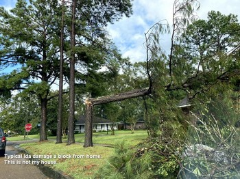

+++
title = "6. Rain and Horses"
date = "2021-10-15"
lastmod = "2021-10-15"
draft = false
showonlyimage = false
image = "blog/2021-11/card-pic.jpg"
categories = ["planning"]
tags = ["shop", "technique", "issue"]
weight = 0
+++

The "big wait" is what much of 2021 turned into.
Spring 2021 brought lots of rain to south Louisiana.<!--more--> And I didn't have a proper sized workshop or garage, so I bound my plywood components together and stored them away with a dehumidifier...

## A Wet Spring
Week after week brought rain showers or thunderstorms, resulting in one of our area's wetest spring and early summer on record. In fact by August Baton Rouge had [surpassed the average annual rainfall](https://www.theadvocate.com/baton_rouge/article_b8a0f68a-faec-11eb-8941-ffd454aa46ba.html). A few photos on this page show how the downpours regularly flooded our back patio. I kept my precious okoume panels safely stored flat on the long workbench in my storage room with a dehumidifier running nonstop. Because I'm building in triplicate, I used drywall screws through the wire stitch holes to bind together sets of like panels, ensuring they would not warp.

## A Long Hot Summer
Which is to say a **normal** summer for south Louisiana, except that the extra rain and cloud cover caused our yards and gardens to flourish, avoiding the drought stress that occurs most summers. Also, I don't recall any triple digit temperatures. Eventually dry weather patterns set in during July, but afternoons were just too hot and my weekends were filled with yard work instead of woodwork.  The next step in my kayak building process is hull assembly, which requires me to do the work under my carport. I was concerned that once I started I'd get to a point that I could no longer fit the boats inside, and I didn't want the unsealed okoume to sit out for perhaps a week or more in the humidity of the carport. Delays working on the boat would be extended not only by weather and my job, but also by family summer trips, a college orientation trip, and other delays. I  procrastinated on kayak construction as I feared damage to my materials.

## Ida
And then we had Ida - August 29 brought Louisiana a category 4 hurricane which has since been identified as the second most destructive storm to ever hit Louisiana. I am thrilled and blessed to report that my home sustained no damage beyond a single broken window. We rode out the storm in our home and then lived for almost a week without electricity - though we did have our engine generator. So, we had a refrigerator/freezer and fans, but no air conditioning, and I pulled out the camp stove for some cooking. Our subdivision is heavily treed with slash pines and water oaks, both of which were prone to wind damage by the storm. Within two blocks of my residence at least six homes had trees through their roofs. We were very fortunate indeed.

## Finally Some Progress
After the back-to-school season of late summer, which for us included our first college-bound student, fall brought generally drier weather than the spring. For us Ida was more about wind than rain. Clearer weather allowed me to make a bit of progress on my kayak building effort, especially after the rate of growth of my St. Augustine lawn abated. Since this is a father and sons project we are building three kayaks simultaneously, and this explains why I need so much space to spread out under my carport for hull assembly. I also needed additional sawhorses. I researched various styles and costs, deciding upon a [design featured in the CLC builder tips](https://www.clcboats.com/shoptips/stitch_glue/sawhorses_slings.html). I purchased some 1" nylon strap material, but most of the wood was salvaged from delivery pallets or lumber pulled from neighbor's refuse piles. Photos of my two sets of completed sawhorse slings appear below.

### Gallery of Images


 

## Looking Towards Holidays
I had envisioned to begin hull assembly during the Thanksgiving break when both sons were home, but weather and travel to mom's house for the holiday conspired against me. I figure I need three good weather days in a row to feel comfortable getting these panels assembled and encased in epoxy. Missing Thanksgiving now pushes this opportunity off to late December which brings the additional concern of low temperatures. I've read that I need 65 degrees F to properly cure epoxy. I'm getting nervous about this project. It is challenging when you lack a climate controlled workshop. No, my wife is not going to let me take over our spatious living room...
