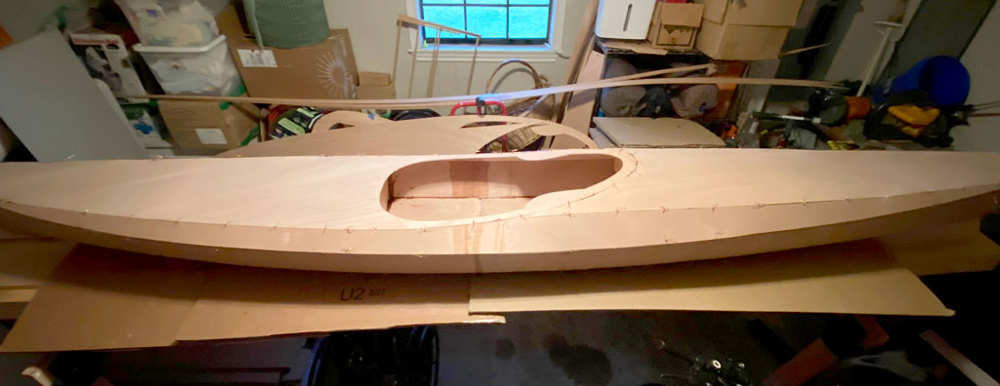

+++
title = "7. Project Resumes"
date = "2021-12-24"
lastmod = "2021-12-31"
draft = false
showonlyimage = false
image = "blog/2021-12/card-pic.jpg"
categories = ["carpentry", "stitching", "gluing"]
tags = ["sanding", "technique", "plywood", "epoxy"]
weight = 0
+++

Divine providence has provided an opportunity to resume building kayaks.<!--more--> Record-setting warm temperatures in the high 70s to 80s, and surprisingly clear skies during our Christmas break allowed my boys and I to really get underway with our kayak building project.

## Cutting, Sanding and Prep

All of the parts and the long workbench were pulled out of the storage room / workshop where they'd been keeping company with a dehumidifier for seven months and set up in the carport where work began. We sanded the edges of the major components down to the pencil lines, and then beveled the edges in preparation for the stitch and glue process. We used the jigsaw to cut out the cockpit from the forward deck, and the hatch doublers with the associated lips and spacers. Portions of two days were spent completing this work and getting all of the components ready to begin the dry-fit stitching together step. 


 

## Christmas Stitching

Today is the day a boat takes shape. All of the preceding sawing and sanding was a lot of work since we are building kayaks from plans rather than precut kits. The warming trend of recent days is continuing with near record highs of 80 degrees or possibly higher here in south Louisiana. We've got two good days remaining before necessary holiday travel pulls me away from this project for three days early next week. By the time we return, rain is forecast to set it. Even if I get to tack weld them together with epoxy, the kayaks won't be fully encased in epoxy so they must be stored in a dry room - perhaps inside the house - during the rainy weather.

On Christmas Saturday I got an early start on some sanding while waiting for the rest of the family to wake up. Once they did, we had the usual holiday gift exchange and breakfast, after which I returned to finish the last beveling of edges on the deck panels with the belt sander. Finally, I began stitching together the hull of the first boat. This process went smoothly with no obvious ill-fitting panels. The most challenging was the rear rear side panel stitch to the rear bottom panels which are strongly twisted. Next, my boys and I proceeded with stitching the deck panels together, and then the forms and sheer panel. Finally, we finished stitching the deck to the hull as darkness fell for the day. All of this is dry fitting to allow for additional sanding and shaping to ensure the panels fit properly. Tomorrow, we'll tweak a few joints, remove the deck, and begin tack gluing the hull and deck components together. Hopefully, we'll dry stitch another boat together as well.


 

## Epoxy Time

On day three of this work period I began by adjusting the fit of the panel edges to each other and tightening the wire stitches. In a few places some sanding was required to provide the desired fit, and this took half of the day. After a late lunch, I removed the deck from the hull and proceeded to mix epoxy, thickening it with saw dust making it brown. Despite reading the warnings I mixed too much, as the instructions suggested I needed one cup. I got about half way through the batch using a syringe to inject the epoxy into the seams between panels. The cup of mix got hot and solidified resulting in waste. The next batch I mixed one third as much and still ended up losing a third of it to solidification. I did get to use one syringe with two batches of epoxy because I cleaned it with vinegar (and cleared it with a wire) in between batches. But I doubt anyone can get more than two uses from a syringe. I learned I have to work quick to apply the epoxy paste to the wood quickly, and worry about cleaning up after.



After tack welding the hull and deck with the epoxy paste I wired the deck back to the hull, skipping every other wire hole, to let it set up overnight. We'll be out of town a few days visiting relatives, so we cleaned up the carport and returned everything into the storage room where the dehumidifier will protect the bare plywood from the forecasted rainy weather. After the rains, cold weather will return next weekend, so no more working with epoxy for a while. I dramatically underestimated the linear feet of copper wire required for stitching, so I ordered an additional 100' roll for each additional kayak. I guess I though I could reuse them. In practice, you can get two uses out of most wires if they weren't tightly wound the first use and you're careful removing and straightening them, but don't expect more than that. I also ordered some "pastry" filet bags for the upcoming step of quickly and neatly applying the epoxy filets to the tack welded seams inside the hull and deck.

