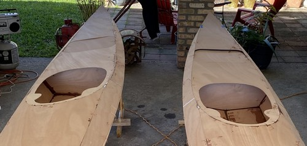
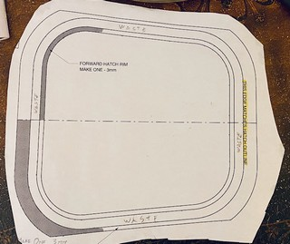
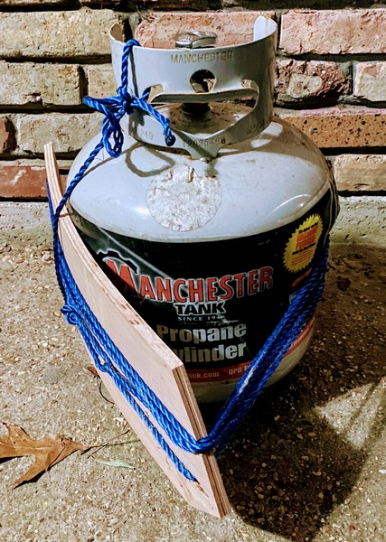

+++
title = "8. Cutting Hatches"
date = "2022-01-17"
lastmod = "2022-01-18"
draft = false
showonlyimage = false
image = "blog/2022-01/pic01.jpg"
categories = ["carpentry"]
tags = ["hatches", "plywood", "tools"]
weight = 0
+++

Time to cut the hatches! I was nervous about this step, but I took my time and it was easy. <!--more--> Even purchasers of cnc kits must cut their hatches out from the deck panels, so we're all in this together. As with previous articles, a gallery of images illustrating my narrative is at the bottom of this post. This work occurred during the third weekend of January, when much of the rest of the nation was receiving record-setting snowfall. Fortunately, south Louisiana was sunny and mild. I even washed cars in shorts and a T-shirt later that afternoon!

## Creating Templates

This is a step most folks won't have to do. Because I'm building 3 kayaks from one set of plans (I paid CLC royalty fees for the additional boats) I didn't want to try to use my only copy of plans to punch through and transcribe the hatch cut lines onto the decks of three boats. I also didn't want to trace using the hatch spacers I cut out previously because, well, they're cut by hand - not a cnc router - so they're got quite perfect. (They're spacers, it doesn't matter.) I spread the hatch plans across my drafting desk and used a pencil to transcribe the cut lines onto tracing paper. I used spray adhesive to firmly stick the traced patterns onto cardboard, and then used an X-acto knife to cut out the hatch patterns. The precisely cut stiff cardboard patterns would be a reliable way to concistently scribe the hatch cut lines onto the deck panels of the three boats.

## Cutting Hatches

After re-reading the CLC build manual and referring to several photos of built Shearwater Sports to be sure I understood hatch positioning, I placed the cardboard hatch templates onto the boat decks and scribed around them with a pencil. I used a 1/16" drill bit to drill 4 or 5 closely spaced holes along the cut lines on at least two sides of each hatch. I then used an extra jigsaw blade held in my fingers to gently cut a slot, allowing insertion of the jigsaw loaded with a very fine metal cutting blade. I've read that some builders use masking tape on the hatch cut line to protect the top of the plywood. I found this was not necessary for me using the fine jigsaw blade and operating it at speed "3". I was able to do a respectable job following the curved corners of the hatches with the saw; not perfect, but I'm pleased with the result.

The left and right (port and starboard, right?) sides of the hatches are cut exactly along the line where the deck panel abuts the shear panels. As I was cutting these lines, through epoxy welds, I considered maybe I should not have tack welded the panels together in these areas. I will try to go light on the epoxy welds when I join the panels of the third kayak we're building. The jigsaw cut right through the cured epoxy without incident.

## Trouble Up Front

The front hatch should line up precisely between the temporary deck bulkheads. I didn't understand this until after I'd begun cutting the front hatches. On one boat, I lucked out and the hatch was between the temporary bulkheads, but on the second I unwittingly drew the cut line right on top of a bulkhead. This made it difficult (impossible?) to cut this line using the power jigsaw. I ended up drilling additional pilot holes to insert the jigsaw in a different position around the hatch and approach the bulkhead from another direction. Then, I used my Japanese pull saw to cut this straight line on the cockpit side of the fore hatch. This has been only the second time I've used this Japanese saw, suggesting to other builders that you can probably get by without one. Perhaps I'll find it useful in future steps such as cockpit combing.

### Gallery of Images


 

## Cold Working Conditions

As January came to a close the weather turned truly cold for Baton Rouge with several back-to-back hard freezes. This halted epoxy work so I turned my attention to carpentry and planning tasks. I stitched together the hull of kayak #3 (of 3), and began cutting out smaller miscellaneous components required in future steps such as hatch toggles, hip braces, and seat backs. These were gleaned from the scraps of okoume plywood I had saved. 

On the cockpit back rests, I'm endeavoring to follow the example of Vaclav Stejskal of One Ocean Kayaks where he [fabricates the seatback from plywood](http://www.oneoceankayaks.com/Wshophtm/Shop18.htm) with an onlay of carbon cloth. I'm going to try with just fiberglass cloth as I don't have any carbon and don't really want to order more supplies. I'm trying this with 3mm Okoume rather than the thinner bendable Birch, so after cutting out the basic shape of the back rests I've begun wrapping them around a propane tank. 

I'm leaving them outside in the humidity of my carport, and I'll try tightening the rope every day or two. Presently, all three are stacked together, but I may need to bend them one at a time so that the plywood is exposed to moisture and can bend. Even if it takes a couple of months I think it will still be useful. 

>Update #1: After a couple of days I see no evidence of progress bending these plywood pieces. I think I'll run several old towels through the steam cycle of my laundry washer and wrap the hot, damp towels around the plywood individually. Possibly this will require repetition. Then, I'll wrap the plywood around the propane tank again - probably individually or with a damp, hot towel between each.