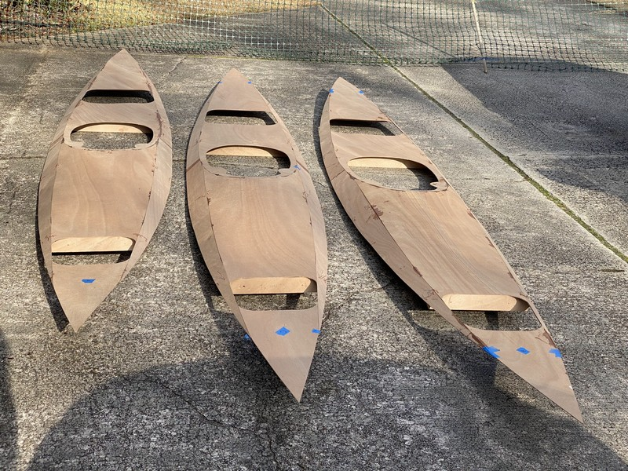

+++
title = "10. You Can't Hurry Love"
date = "2022-02-07"
lastmod = "2022-02-13"
draft = false
showonlyimage = false
image = "blog/2022-02a/card-pic.jpg"
categories = ["carpentry", "gluing"]
tags = ["plywood","sanding", "hatches"]
weight = 0
+++

No, you can't hurry love when you're building three kayaks from plans.<!--more--> And, when you don't have a climate-controlled shop in which to work and spread out one's tools and materials. I credit much of my progress to the splendid weather we've enjoyed on many of the weekends this winter. A few days were warm enough for epoxy work, and I completed carpentry tasks on the cooler days.

I've now succeeded in bringing all three boats to the same stage, which at the end of February will hopefully be ready for fiberglass. At that time both sons will be home on break from college and high school for the Mardi Gras holidays. I want them to be able to participate in a transformative step in the boat building process.

## Hatches Doubled

The warm weather during the second weekend of February allowed me to mix up some epoxy with silica, making a glue paste for gluing the hatch lids to their matched lid doubler. The doubler is simply a second sheet of okoume plywood roughly 1" smaller in all dimensions around the edges. Bonded to the middle of the lid, the doubler adds strength and rigidity to the hatch covers. I applied the epoxy fully to both plywood surfaces using a plastic squeegee. Not having enough clamps for three pairs of hatches, I used objects including bricks, a log, and car batteries resting on top of scrap lumber to distribute the weight across the hatches on a sturdy table. (See photos below.) I laid a sheet of wax paper between the hatch and the stock lumber to ensure no sticking. As the epoxy began to cure it oozed out the edges around the doubler so I kept having to remove all of the weights or clamps to gain access and remove excess epoxy with my squeegee. After about an hour the oozing ceased and I was able to relocate all of the glued hatches to my work table inside my storage room, replacing the weights on top of them, where I left things to cure overnight.

### Gallery of Images


 

## CNC Is Faster

One thing I've come to understand is what a tremendous time savings exists for those builders starting with a CNC kit instead of plans and raw lumber. For example, today I spent most of my afternoon simply sanding to shape the components for the deck hatch sills and spacers which were cut out with a jigsaw. I tried to leave a bit of a buffer and I had to sand the excess wood down to the pencil line. Since I'm building three Shearwater Sports at once I do enjoy some assembly line efficiencies, but it's no Henry Ford manufacturing plant. I watch YouTube shop videos from [CLC](https://www.clcboats.com/default/clc-boat-building-videos.html) and other builder's time lapse movies and I'm a little discouraged at how slow my progress is. The Supremes were right, you can't hurry love. But I know I've been fortunate with the weekend weather so far this winter and I'm excited as these boats start to take shape. I am really looking forward to that first paddle experience on a local lake! I'll just have to wait.
