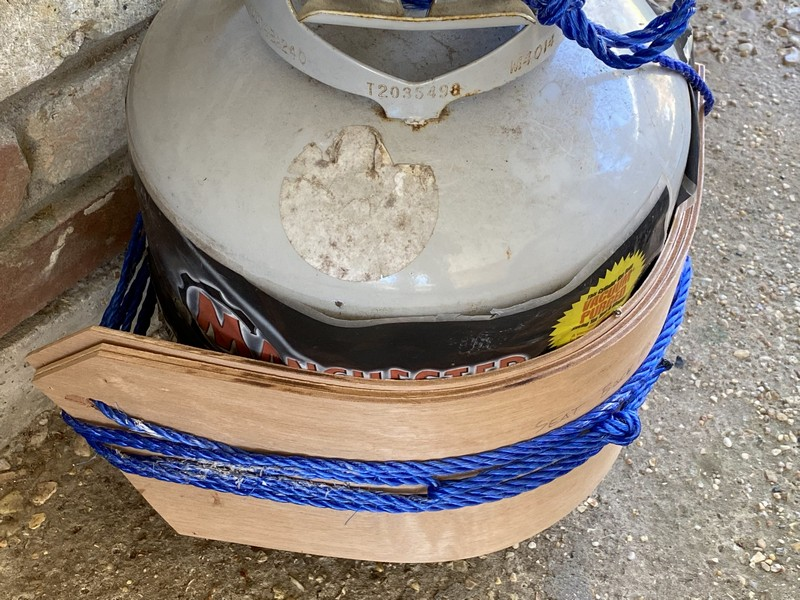
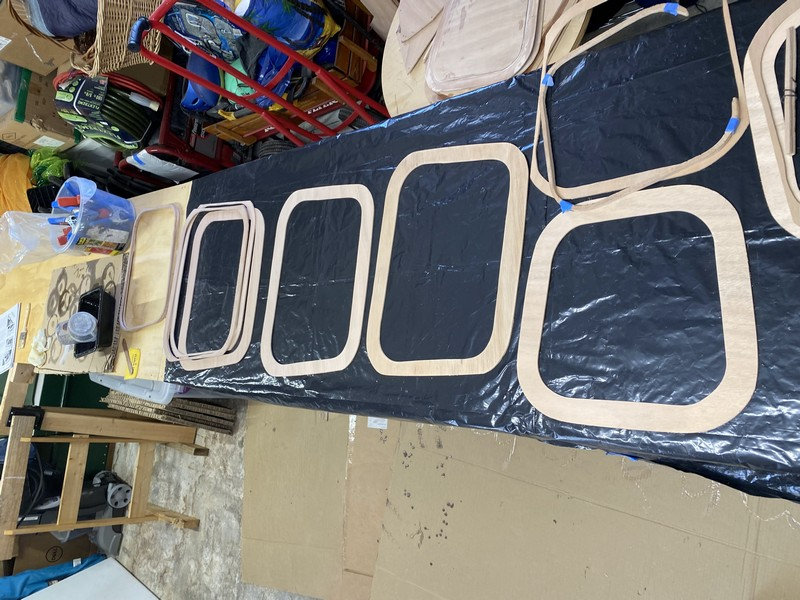
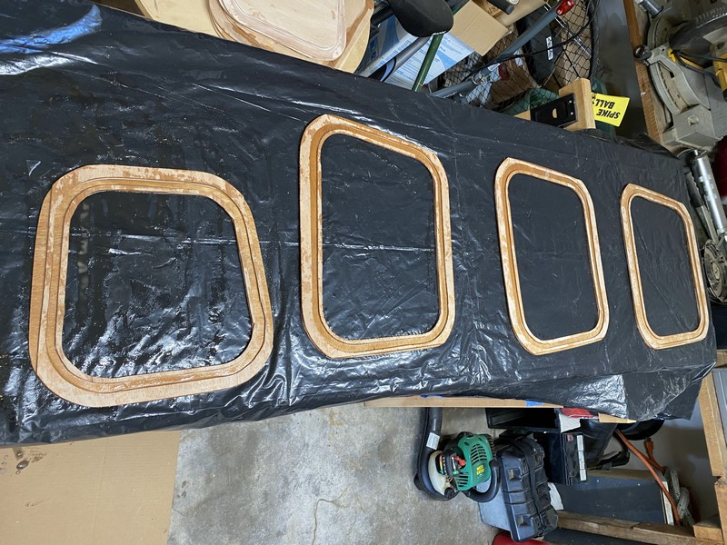
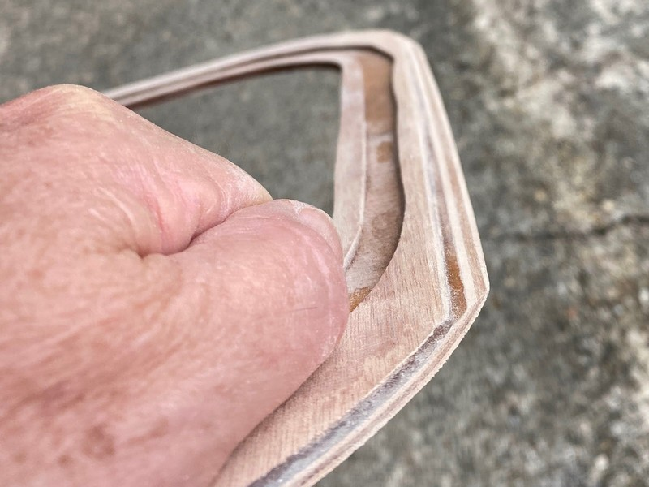
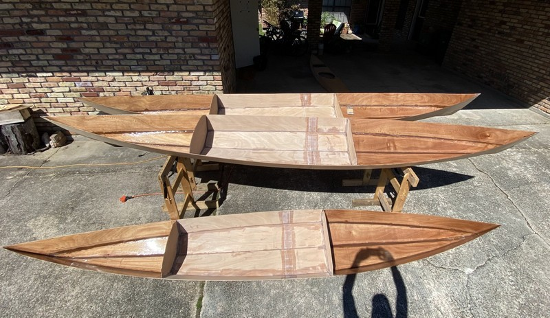
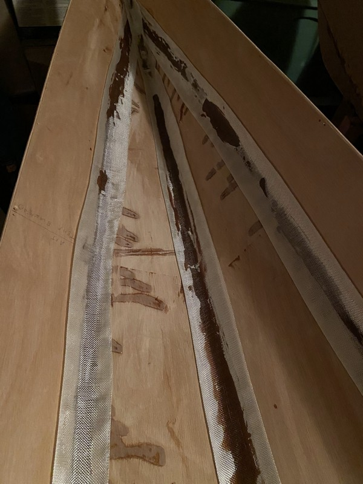
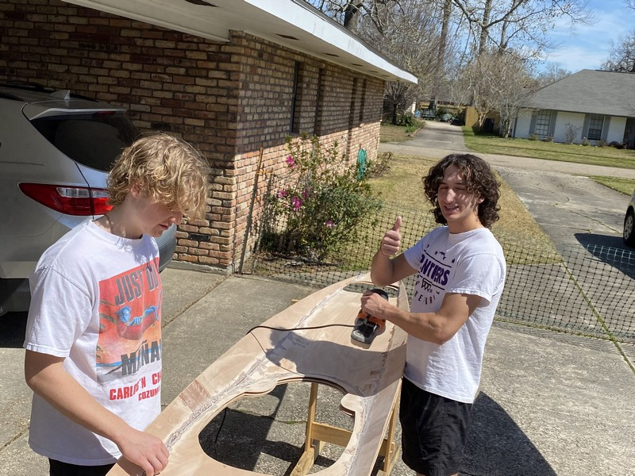
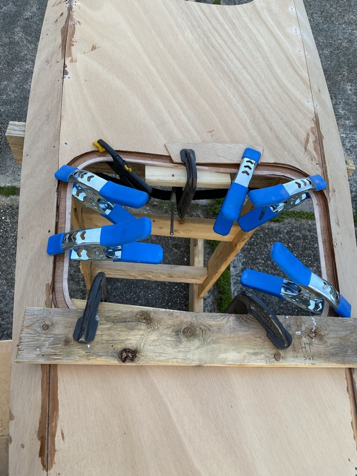

+++
title = "11. Mardi Gras Mambo"
date = "2022-02-28"
lastmod = "2022-03-01"
draft = false
showonlyimage = false
image = "blog/2022-02b/mardi-gras-card.jpg"
categories = ["gluing"]
tags = ["epoxy", "technique", "fiberglass", "hatches", "sanding"]
weight = 0
+++

Watch a parade, sand the kayaks, watch another parade, mix and apply some epoxy, catch a third parade, more sanding... sleep. <!--more--> The Mardi Gras season of 2022 came late in the winter and was accompanied with some spectacularly pleasant weather. Sunny days warming enough to work with epoxy and abundant vacation leave allowed the boys and I to make much progress as February rolled into March.

## Bending Seat Backs

About a month ago I started trying to bend some 4mm plywood to serve as seat backs. It was slow at first as teh wood was fully dry, but then I pulled some steaming damp towels from the washer and wrapped each ply sheet and again bent them around the propane cylinder. I did this twice over a period of three weeks. *It worked!* The plywood seat backs now conform to the curve of my back, and it seems to fit within the yet unassembled cockpit. 

I've now wrapped the plywood sheets a third time around the gas cylinder, tightening it even more to hold them in shape until I'm ready to apply a layer of fiberglass & epoxy across their backs. I plan to wrap the cylinder first with a plastic garbage bag, then the plywood, then a layer of epoxy saturated fiberglass, then a layer of wax paper, and finally another plywood seat back all compressed together and wound with rope.

## Hatch Sills

My hand cut hatch sill components weren't perfect. Two of the more delicate spacers got broken, and I knew there was no way I could sand them to shape - beveling the edges - to fit properly beneath the hull against the port and starboard sheer panels. I departed from the instructions in the [CLC manual](https://clcboats.com/) and decided to glue them together on my flat workbench first. Three days later when the epoxy was hard set, the components were no longer delicate and I was able to confidently sand them to shape with a belt sander. Since I'm making three pairs of hatch sills, using the belt sander made this process much faster.

## Sanding and Prep

I used the cool mornings to sand down the rough epoxy tack welds (and some early attempts at filets that I didn't clean up very well.) *Note to self: it is always much faster to remove excess and clean up rough epoxy when it is still wet.* 

Last week my wife and I completed the filets and fiberglass tape application to the fore and aft hull compartments of all three boats. It was quite an effort. This week the goal is to finish the interior of all boats (at least the first epoxy coat,) including bonding the hatch sills to the undersides of the decks with epoxy and applying the layer of fiberglass & epoxy to the underside of decks. Likely, we won't attain this stage until next weekend.

## Hull Filets

Hull filets were made with epoxy thickened with sawdust to the consistency of peanut butter. One batch I failed to get it thick enough, and the result was a sloppy job as the epoxy kept running out of the joints and puddling. Some builders might have scraped out the too-thin epoxy, discarded it and start over with a fresh batch and maybe I should have too. I didn't. As the too-runny epoxy began to react and set up, it did get firmer and I used my round-point plastic spatula to push it into shape. But it did leave dark stained areas from the thickened epoxy where they shouldn't be on the plywood panels.



Another noobie mistake I made was to affix the fiberglass tape to the filets too soon, before they had sufficiently firmed up. The brown filet epoxy soaked through the fiberglass fabric. I feel it would have been better to wet the fabric top down with clear epoxy and I've tried to do this with subsequent efforts. 

I did not apply masking tape to the hull prior to creating the filets. I should have done this at least in the cockpit area where it is visible. Tape, plus some paper masking the rest of the hull panels would have helped me to have a cleaner, crisper joint. It has now been over a year since I began this project and I think I'm just ready to complete them so we can go paddling.

## Deck Underside

Since I was a bit aggressive in the quantity of epoxy used to tack weld the deck panels together several weeks ago, I was in for considerable sanding to prepare decks to receive a full covering of fiberglass fabric. I sanded two of the decks, then got some help from the boys on the third while I sanded messy joints around the bulkheads.

## Gluing Hatch Sills

The hatch sills needed to be bonded to the decks with thickened epoxy before covering the entire underside of the decks with a fiberglass layer. I applied epoxy to both surfaces before lining it up and clamping it together. I got the rear hatches glued and clamped as Mardi Gras day came to an end. 

An additional vacation day on Ash Wednesday will allow me to glue and clamp the front hatch sills. If I complete that in the morning it should have time to harden so I can remove the clamps and fully fiberglass the underside of decks in the afternoon. In between I'll install the post bolts for foot braces on the decks and coat the underside of hatch covers with clear epoxy. My goal is to fully complete the interiors of the kayaks - minus applying the second coat of clear epoxy - which I can do over the coming weekend.

### Photo Gallery


 
