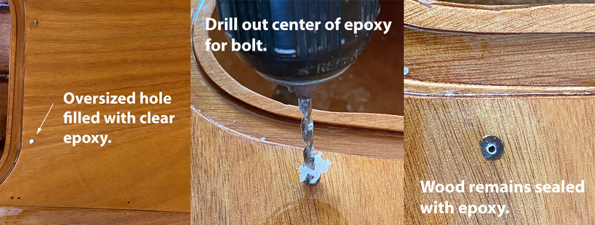

+++
title = "18. Varnish, Sand, Varnish"
date = "2022-10-10"
lastmod = "2022-10-11"
draft = false
showonlyimage = false
image = "blog/2022-10a/card.jpg"
categories = ["finishing"]
tags = ["sanding", "varnish", "hatches", "supplies"]
weight = 0
+++

This process is exciting! It is so rewarding to see the beauty of the wood grain revealed by this quality wood finish. <!--more--> 

The kayaks are really looking nice and it is so exciting to see their beautiful lines amplified by the gloss of the first coat of varnish. The dry and moderating weather is conducive to applying wood finishes. But, fall also brings college football, which can get in the way of progress on hobbies like kayak building. After all, when one receives really good complimentary tickets to an SEC home football game - one goes! Geaux Tigers!

## Products

After **much** research I settled on Pettit Z Spar Flagship 2015 Varnish. Each kayak requires about one quart, so I economized by purchasing [one gallon](https://www.wholesalemarine.com/pettit-flagship-varnish.html). Pettit has a useful educational video comparing their products. *Any mention of brands or links to manufacturer websites in my blog are for the convenience of the reader. This blog is not monetized and I earn nothing from endorsements.*



From the video and product literature I learned that Flagship 2015 has 6x the UV inhibitors as Captain's 1015. It builds 2x as fast as Captain's, due to more solids. It was stated, "In Florida, Flagship will last much longer than Captain's" so to me that bodes well for south Louisiana.  A drawback of Flagship is some find it more challenging to apply because amateurs tend to lay it on too thick. Dilute it.

[How to brochure... PDF](/stitchnglue/pdfs/stitchnglue/Pettit-how_to_varnish.pdf)

 

[Product Data Sheet PDF](/stitchnglue/pdfs/stitchnglue/Pettit-flagship-high-build-varnish-product-data-sheet.pdf)

 

> I used ["stop loss" bags](https://www.clcboats.com/shop/products/new/clc-stoploss-kit.html?fbclid=IwAR1k0PZfrf-rtAJ4zeIEk1KCr8TYvQE_rg8-1NKePs8kiATQhUzVBhhxL7w) purchased from CLC to immediately divide the gallon of Flagship varnish into three 1-quart bags. The remaining varnish was diluted and applied as the first coat on the three kayaks, paddle blades and seat backs.

Opening that can for the first time was a special moment. The smell was pleasantly powerful and the color like honey. Flagship is nearly as thick as honey too, so must be diluted to flow easily.

## Process

At a high level I followed the process recommended by the manufacturer - Pettit - and by the CLC build manual and tutorial videos. 

1. Sand the last epoxy coat with 220 grit to remove bumps and runs. Much of this was accomplished with a random orbital sander.
2. Vacuum up as much dust as possible.
3. Use the leaf blower to blow leaves, dust, etc. out from my carport work area. (It is open on two ends, allowing breezes to flow through.)
4. Wet down the carport floor with a water hose in an effort to immobilize dust.
5. Wipe down the sanded kayaks with a tack cloth. I used laundered old towels dampened with isopropyl alcohol as a solvent to remove any grease.
6. Apply 1st coat of varnish.

Okay, but exactly how did I apply it? I started on the hulls with the boats upside down.

7. Thin the Pettit varnish. I cut it about 30% with gum turpentine in a plastic mixing cup.
8. Using 3" foam brush applicators, I applied vertical strokes, starting at the center of the bottom (keel) and working down to the chine where the hull joins the deck.
9. Work in sections no wider than about 12", and immediately switch the brush direction to horizontal strokes, working in one direction from the bare wood towards and through the newly applied varnish. Applying both vertical and horizontal strokes helps insure no missed spots (holidays) and wipes up any runs.
10. Be careful at the bottom of your work here - the chine - to make sure the varnish isn't running down onto the deck. I missed some of these, and it requires considerable sanding to remove the runs.

Subsequent coats require scuffing in between.

11. Between 1st and 2nd coats I sanded pretty aggressively with 400 grit wet-sand paper. (Necessary due to the runs I didn't notice while applying the first coat.) I used a spray bottle of water to keep the sandpaper and surface wet.
12. Wipe down with plain water and terrycloth towels to remove the sanding residue. Clean any grooves such as under the cockpit rim.
13. After drying thoroughly (several hours on a warm dry day) and immediately prior to varnishing, wipe again with a clean terrycloth dampened with isopropyl alcohol.
14. Apply 2nd coat of varnish with a foam brush, thinned about 20% with turpentine.


 

How many coats? Minimum of 3, some say 5 is enough, others recommend 7 coats. I intend to apply four coats and then stop for now as I'm eager to begin paddling these boats! I can always apply additional coats of varnish in the future.

## Hatch Lids & Toggles

I've repeatedly test fit the hatch lids into the recesses as I worked on the kayaks. Some sanding helped the fit and they all generally fit, but some fit better than others. I believe addition of foam weatherstripping and the pressure of the toggles themselves will hold the lids flush. Building three boats at once required me to spend an afternoon cutting out 24 (plus a few spare) oval toggles by hand. Holes were drilled as indicated on the plans, and they were sanded smooth before being coated in two coats of clear epoxy. Next, another sanding with 220 grit and a coat of varnish was applied. Work was accomplished one side at a time, and the toggles spread out to dry on an aluminum cooking sheet. Three coats of varnish, with scuff sanding in between coats, was necessary to provide the desired build-up. 

### Attachment Method

The CLC build manual describes the process of attaching the oval wooden hatch toggles to the deck with wood screws. Instead, I've decided to use #8 bronze bolts purchased from [Fairwind Fasteners](https://fairwindfasteners.com/), with assorted washers and nuts to hold them securely in place. Below is a photo of the hardware. I also purchased some nylon washers to insert between the varnished deck and toggle to eliminate most of the friction and wearing of the finish. 

## Drill-Fill-Drill

I'm using the "drill - fill - drill" method to create holes in the deck. This is necessary to prevent water intrusion into the wood. The end grain of the wood is sealed with epoxy.

[Click for the CLC shop tip](https://www.clcboats.com/shoptips/fitting_out/drill_fill.html)

1. Drill oversized holes in the deck to accept the through-bolts. (I used a 5/32 diameter bit for a #8 bold size.)
2. Seal the bottoms of the holes - inside the kayaks - with masking tape.
3. Using a syringe, fill each hole with clear epoxy.
4. Drill again, in the center of the epoxy, with a smaller 5/16" bit just large enough to accommodate the bolt.

 
