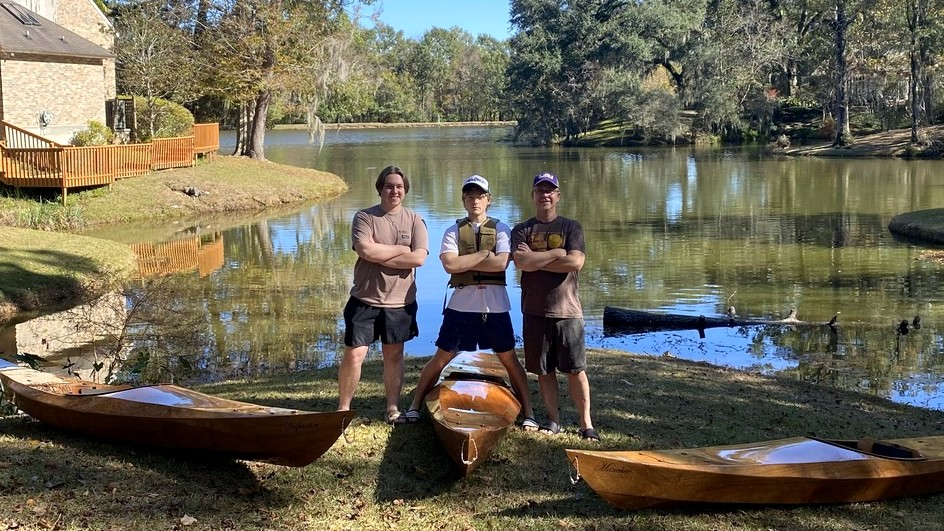

+++
title = "20. Launch!"
date = "2022-11-01"
lastmod = "2022-12-30"
draft = false
showonlyimage = false
image = "blog/2022-11/pic01.jpg"
categories = ["paddling"]
tags = ["design"]
weight = 0
+++

At last it is time to launch these vessels and see how they perform. The first will be a family-only "soft" launch event. Later I'll schedule a public "launch party".<!--more--> It has been two years of weekends and holidays crafting this beautiful wood into three kayaks - taking more than twice as long as I anticipated. I experienced months-long delays due to poor weather or family commitments, and it is thrilling to finally put them to use.

## Pre-Launch Test



The last (4th) coat of varnish had a week to cure and harden, and late that Sunday I outfitted the boats with seat pads, foot rests, and  hatch covers secured with toggles. While the above video is not the celebratory public launch party, it did provide me an opportunity to try things out. I'm glad I did as I learned several things:

1. My method of riveting the straps holding the seat back in place was inadequate (or, I need to lose some weight.)
2. The kayak did perform quite well as I paddled across the lake, noticeably faster than the old sit-on-top I used to own.
3. The paddle, in particular it's length, worked well. It seems no heavier than typical sporting goods store paddles, although it is heavier than expensive carbon fiber paddles.
4. Most enlightening - getting out of the kayak is more challenging than getting in. I rolled it at the boat ramp, scratching the hull on the concrete ramp. (It was quickly repaired the following day with a coat of varnish.) Entering and exiting the kayak will be easier at a sandy, beach-like launch site.

 

## Roof Rack

The J-hook roof racks held the boats securely for the ride to the lake. Padding on the tubular steel bars is generous, protecting the kayak from scratches. The bottoms of these J-hook racks is somewhat hard plastic. It would be no issue on a plastic boat, but it would scratch or mar my wooden boats. 

Using excess minicel foam I glued squares on top of the bases of the racks with compound cement. This additional padding fully protected my boats from damage during transport.
  

## Family Launch

 

For the very first launch of the three kayaks I wanted just my sons and I to go paddling together, and mom accompanied us to the shore of the lake to experience the thrill with us. We drove to a nearby private empoundment on the banks of the Amite River surrounded by homes. There is limited public access and no dedicated parking so we parked in a cul-de-sac and accessed the water's edge via an apparent drainage servitude between adjacent lots. 

> Later I checked the Parish tax assessor's maps and there is no servitude. We were totally trespassing across the tip ends of two homeowner's lots. Oh, well...nobody called the sheriff.

The weather was blue skies and mild temperatures which made the first paddle particularly enjoyable. This time I adjusted my technique for entering and exiting the boat so there were no rolls or wet clothes. Different from my old sit-on-top kayak or canoe, I must expect to get wet feet every time I enter or exit these sea kayaks and I'll dress accordingly. The three of us enjoyed about an hour of paddling around the small lake, testing our leaned turns and "sweep" strokes to redirect our boats. All of us found them to be comfortable, responsive to our paddling, and not "tippy" at all. The seats were comfortable: bottom, hip pads, and back rests. I found the foam pads beneath the knee brace tabs on the cockpit rim to be helpful and comfortable. We are quite pleased with these kayaks and look forward to embarking on a "real" paddling trip down a bayou some day soon. The last remaining task is the teck rigging with bungee cord and I'll get that installed over the holidays.



 

Click an image to enlarge...


 

## Lake Martin, Alabama

We traveled to mom's house on Lake Martin in Alabama during the Christmas holidays. We took the boats out for short paddles two days during our visit, launching from Smith Landing public boat ramp.



Day One
 



Day Two

 We look forward to return visits in the spring - hoping to take longer trips paddling across the lake to [Smith Mountain](https://howisjt.com/posts/travel-alabama-lk-martin/#smith-mountain) itself and hiking up for a panoramic view from the restored fire tower.
  