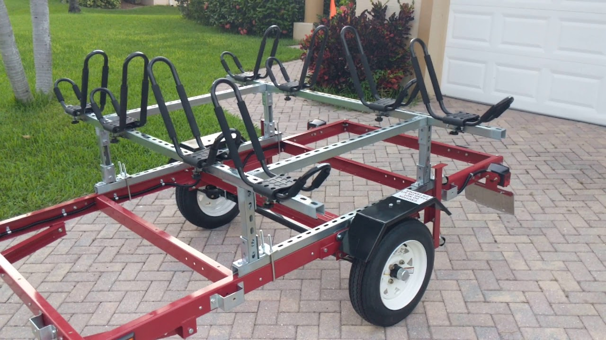

+++
title = "21. Let's Travel!"
date = "2022-12-26"
lastmod = "2022-12-26"
draft = false
showonlyimage = false
image = "blog/2022-12/pic01.jpg"
categories = ["paddling"]
tags = ["trailer"]
weight = 0
+++

Time to Load and Go! 
Months of browsing ads on Facebook Marketplace finally paid off with the purchase of a great trailer. It was one of few used trailers having a clean title.
<!--more--> I also spent a lot of time searching paddling blogs and YouTube videos for various custom trailers that folks have built for carrying three or more kayaks. There is tremendous diversity and some very creative people. A few have purchase factory made trailers and kits, but the majority start with a utility or old boat trailer base and add custom racks to carry their boats and kit. 

## My Trailer

I was fortunate in finding a single axle 14' long galvanized jon boat trailer manufactured by McClain Trailers in 2016. It seems I'm the third owner. The first constructed an "A-frame" atop a base with J-hooks on each side to carry two fishing kayaks. The second added a plastic cargo box up front and a steel grate tray in the back. I added a pair of J-hooks to the top to carry the third boat.

I'm extremely pleased with my purchase. Retail price of this trailer alone at Academy Sports $1,400 and I paid just $350, plus State fees for tax, title and tag. It was one of very few I saw advertised over the past six months which came with a clean title. Many sellers offer a bill of sale (which would have to be notarized in Louisiana,) and others would refuse to do even that. The seller of the trailer I purchased met me at an Office of Motor Vehicles where we completed the transaction. Another bonus I got is all of the rigging, cargo box and steel cargo tray, plus a few paddle-sport related items left in the cargo box the previous owner did not want. I checked the wheels and there is no wobble, so I know the bearings are fine.

### Trailer Photos

*Click to enlarge any thumbnail in this gallery.*

One of the below photos of the top of my van shows one way I thought I might be able to carry three kayaks atop the vehicle. I never tried to fit them up there. It would at best be inconvenient, because I'd always need to bring along a step ladder (or two) to get the boats up there. Strapping them down would be a challenge. I was also concerned about the wind load on those three boats - traveling at interstate speeds - possible breaking the factory roof racks. After all, they're screwed down with one bolt at each side, through plastic resin brackets. It isn't beyond comprehension that the trio of kayaks could literally blow off the van while traveling at high speed. A similar thing happened to me in high school when we lost a rack full of snow skis off the roof of a sedan. (Most skis were salvageable, and thankfully no other vehicle was involved.) 


 

## What's Next?

I've built three kayaks for my sons and I, but mom is the fourth member of our family and I also own a canoe. Actually our dog makes #5 as he likes rides in the canoe.

In the future I need to add capacity to carry the canoe in addition to the three kayaks on this trailer. It will require a complete overhaul of the A-frames. I'm thinking of constructing a box frame using unistrut material similar to that shown on the utility trailer photo below. I would build the top cross bars higher, to allow room to slide the canoe in beneath. Three pairs of J-hook carriers across the top bars would carry the three kayaks. 

